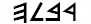
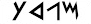
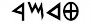

## Phoenician Fun by Harold Somers

### Introduction

The Phoenician script can be dated at around 1050 BCE, and from it
the Arabic, Hebrew and by extension Greek, Roman, and Cyrillic
scripts evolved.

### The Problem

The Phoenician civilization was centered along the Mediterranean
coast in an area known as Cana’an. The map below shows a number of
Phoenician cities and nearby cities that were important trading
partners. The spellings reflect their pronunciation in Phoenician.
However, two of the cities on the map are shown with their modern
names which are very different from what they were called in
Phoenician times.

{:.text-center}

### The Question

Match up the Phoenician names in the list below with the names on
the map. Remember, two of the names will not match, so you should
have two names left over.

| 1 |  |
| 2 |  |
| 3 |  |
| 4 |  |
| 5 |  |
| 6 |  |
| 7 |  |
| 8 |  |
| 9 |  |
| 10 |  |
{:.table}

Match the names below with the numbers above. There will be two cities left unmatched.

| Aynuk | ? |
| Beritos | ? |
| Ebla | ? |
| Halab | ? |
| Megiduw | ? |
| Palmyra | ? |
| Qadesh | ? |
| Riblah | ? |
| Tripoli | ? |
| Sarepta | ? |
{:.table}

### Acknowledgements

This question is 2013G from the [NACLO problem set](http://www.nacloweb.org/) developed by Harold Somers.
