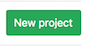

# Homework setup

Start by {{ site.hwdates[0].startdate }} or earlier |
Due on {{ site.hwdates[0].deadline }}

### Setup on Coursys

Find a group to work with for the homework assignments and the final
course project. The group size is typically between 3 to 5 people.
We will be checking that all group members are contributing equally
to the homework submission and the final project.

Along with your group members, register yourself as part of a group on [Coursys]({{ site.coursys }}).

Create a memorable name for your group. If you need help, [seek help](https://www.wordlab.com/name-generators/team-name-generator/).

Go to the [Course Discussion Page]({{ site.coursys }}) and select `Manage Subscription`.
Change the `Notification` to `Email me for new topics and replies`. It should look like this:

### Setup Git Repository

#### Git Basics

In this course, your programs will be managed and archived using [Git](https://git-scm.com). The basic idea is as follows:
* Every student and group gets a private storage area called a repository on the SFU server machines, or "repo" for short.
* Your code is stored in your repo. Every time you make a change to your code, you *commit* a new *revision* of your code to the repo for permanent storage. All revisions you ever commit are kept, and you can retrieve any committed revision any time. This means you have a combined backup and means to undo any changes you ever make. This is how software engineers manage their code projects.

#### Create new repository on Gitlab 

Decide in your group the person that will create the repository on
GitLab and invite the other group members as Developers. That person
should follow the instructions in this section.

Go to [the SFU Gitlab server](http://gitlab.cs.sfu.ca){:target="_blank"}
which is on the web at
[gitlab.cs.sfu.ca](http://gitlab.cs.sfu.ca){:target="_blank"}.  Log
in with your SFU username and password, the same one you use to
check your e-mail on SFU Connect.

Once logged in, you will see a list of your existing repos if you
have created any in the past. Create a new repository for this class
by clicking the `New Project` button at the top right of the page.

On the `New Project` page, give your repo a name under the `Project
name` field. The default name is `my-awesome-project` which is
**not** what you should call your repo. Instead, name your repo:
`nlpclass-{{ site.semcode }}-g-GROUP` where `GROUP` is the group
you registered on [Coursys]({{ site.coursys }}). For example, a
repository name might be `nlpclass-{{ site.semcode }}-g-ethicsgradient`
Make sure you add the `g-` before your group name. It's important
to name the repo exactly as you see here.

Leave all other settings as they are and click the `Create Project` button
at the bottom left of the page.

Make sure you do not change the default setting of `Private`. Your
repo must be visible only to yourself and your group members.  
**You must not give access to your repo to any other students except your group members**.
Plagiarism is a serious academic offense.

Your repo has now been created. You will be taken to a web page for
your newly created repo.

The course instructor and the TAs need access to your repo in order to test
and  grade your code. Add the instructor and TAs as a member of your
repo by clicking on the Settings menu which looks like a gear icon <i class="fa fa-gear"></i>`Settings`
on the left hand menu and selecting `Members` from the dropdown menu. On the page that loads up
type in or individually copy/paste the following list of names in the `Add new user` box using a `,` to
delimit each username: <code>{{ site.instructor }}</code>, 

<code>{{ ta.email }}</code>, 
. 

Change the role permissions from `Guest` to `Developer` in the
dropdown menu. Click on `Add to Project` to add the instructor to
your github repo.

#### Setup SSH Key

Next we will set up the Secure Shell (ssh) keys so you can access
your repo without a password. First follow [the instructions on
setting up your SSH key pair](https://csil-git1.cs.surrey.sfu.ca/help/ssh/README)
available at [csil-git1.cs.surrey.sfu.ca/help/ssh/README](https://csil-git1.cs.surrey.sfu.ca/help/ssh/README).
**Follow the instructions for Linux**.

Now we have to copy your public key to the GitLab server.
**The [instructions](https://csil-git1.cs.surrey.sfu.ca/help/ssh/README) ask
you to use `xclip` which may not be installed on all the CSIL machines.
If you cannot find `xclip` ("Command not found") then do the
following steps**

If you have set up your SSH key correctly then you will have a public key. View it

	cat ~/.ssh/id_rsa.pub

This will show you the public key. Use the `Terminal` copy command to **copy**
this into your clipboard.

Then go to [this page](https://csil-git1.cs.surrey.sfu.ca/profile): [csil-git1.cs.surrey.sfu.ca/profile](https://csil-git1.cs.surrey.sfu.ca/profile) and select `SSH Keys` from the left menu.

Use the web browser to paste command to **paste** your public key into the `Key`
box and give it a `Title` (e.g. 'CSIL' is a reasonable title) and then `Add key`.

#### Clone your Repository

Download a copy of your repo to your CSIL machine.  The action of
making a local copy of your online repo is known as a "clone".

In the terminal window, enter the commands

	git config --global user.name USER
	git config --global user.email USER@sfu.ca
	git config --global core.editor nano
	git config --global push.default current
	cd $HOME
	git clone git@csil-git1.cs.surrey.sfu.ca:USER/nlpclass-{{ site.semcode }}-g-GROUP.git

where `USER` is your SFU username and `GROUP` is the name of the
group you have already setup on [Coursys]({{ site.coursys }}). If
you skipped any of the above steps in setting up your GitLab repo
this command will not work.  The system might prompt you for a
username/password combo. Supply the usual answers. To avoid entering
your username/password over and over again you can set up [passwordless
ssh](http://www.linuxproblem.org/art_9.html).

Your repo will be cloned into a new directory (also known as a folder)
called `nlpclass-{{ site.semcode }}-g-GROUP`.

