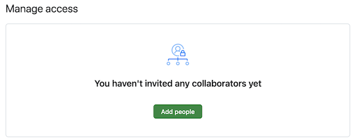

# Homework 0: Setup

Start on {{ site.hwdates[0].startdate }} |
Due on {{ site.hwdates[0].deadline }}

## Setup on Coursys

Find a group to work with for the homework assignments and the final
course project. The group size is 3 people or less.
We will be checking that all group members are contributing equally
to the homework submission and the final project.

Along with your group members, register yourself as part of a group on [Coursys]({{ site.coursys }}).

Create a memorable name for your group. If you need help, [seek help](https://www.wordlab.com/name-generators/team-name-generator/).
Make sure there is no whitespace in your group name or anything that might cause a mojibake (please use plain ascii).

> **_Important:_** Do not use any obscene words in your group name. Be mature about your choice of group name. That does not mean it cannot be funny, just be aware that your choice of group name may offend someone else so be considerate of others.

Go to the [Course Discussion Page]({{ site.coursys }}/forum) and select `[Activity Digest]`.
Change the `Digest Email Frequency:` to a setting that send you email notifications, like so:

## Setup Git Repository

### Git Basics

In this course, your programs will be managed and archived using
[Git](https://git-scm.com). The basic idea is as follows:

* Every student and group gets a private storage area called a
  repository on the SFU server machines, or "repo" for short.
* Your code is stored in your repo. Every time you make a change
  to your code, you *commit* a new *revision* of your code to the
  repo for permanent storage. All revisions you ever commit are kept,
  and you can retrieve any committed revision any time. This means
  you have a combined backup and means to undo any changes you ever
  make. This is how software engineers manage their code projects.

### Create new repository on SFU Github Enterprise

Decide in your group the person that will create the repository on
[SFU Github Enterprise](https://github.sfu.ca/){:target="_blank"}
and invite the other group members as a
Developer with write/admin permissions. The main maintainer in the
group should follow the instructions in this section.

Go to [SFU Github Enterprise](https://github.sfu.ca/){:target="_blank"}
and log in with your SFU username and password, the same one you use to
check your e-mail on the SFU Outlook mail server. You should
enable 2FA if you have not done so already and also go through
the 2FA authentication.

Once logged in, you will see a list of your existing repos if you
have created any in the past. Create a new **Private** repository for
this class by clicking the `New Repository` button (if this is your
first repository on SFU Github) or the `New` button to create a new
repository for the homework assignments for this course.

On the `Create a new repository` page, select a `Repository name`.
You must name your repo: `nlpclass-{{ site.semcode }}-g-GROUP` where
`GROUP` is the group you registered on [Coursys]({{ site.coursys }}) (see above).
For example, a repository name might be `nlpclass-{{ site.semcode }}-g-ethicsgradient`.
Make sure you add the `g-` before your group
name. **It is important to name the repo exactly as you see here.**

Write an optional `Description`.

> **_Important:_** You **must** choose this repository to be
`Private`. We will not accept any repository for the homeworks in
this course that is marked as `Public`.  Your repo must be visible
only to yourself and your group members. **You must not give access
to your repo to any other students except your group members, the
TA(s) and the instructor.**.

Plagiarism is a serious academic offense.

At any point in the future you are also not allowed to either mark
this repository as Public or copy the code to a different public
repository (on Github or elsewhere).

The other initialization choices are optional (there is more about
setting up your `.gitignore` file below).

Then click on the `Create repository` button.

Your repo has now been created. You will be taken to the web page
for your newly created repo.

### Add the instructor and TA as Developers

**This is the most important step in the setup of your GitHub repository**

The course instructor and the TAs need access to your repo in order to test
and  grade your code. Add the instructor and TAs as a member of your
repo by clicking on the Settings menu and choosing `Add People` which looks like this:

On the page that loads up type in (or individually copy/paste) each of the
following list of names: <code>{{ site.instructor }}</code>,

<code>{{ ta.email }}</code>,

and invite them as a Collaborator.

### Set up notifications

You should be automatically set up to "Watch" changes to your
repository, but ensure that you are watching changes.

Set up your notifications by going to your personal settings
accessed through your user icon on the upper right corner:

Then select `Notifications` (with the bell icon) and make
sure you are notified about changes to the repository:

Make sure you are notified about Github Issues.

### Setup SSH Key

Next we will set up the Secure Shell (ssh) keys so you can access
your repo without a password. If you do not already have an SSH key then first [generate a new ssh key](https://docs.github.com/en/authentication/connecting-to-github-with-ssh/generating-a-new-ssh-key-and-adding-it-to-the-ssh-agent).

If you have set up your SSH key correctly then you will have a public key. View it

    cat ~/.ssh/id_*.pub

Then add your public SSH key to the GitHub server using [these instructions](https://docs.github.com/en/authentication/connecting-to-github-with-ssh/adding-a-new-ssh-key-to-your-github-account).
.
### Clone your Repository

Download a copy of your repo to your CSIL machine.  The action of
making a local copy of your online repo is known as a "clone".

In the terminal window, enter the commands

    git config --global user.name USER
    git config --global user.email USER@sfu.ca
    git config --global core.editor nano         # or set it to your favourite editor
    git config --global push.default current
    cd $HOME
    git clone git@csil-git1.cs.surrey.sfu.ca:GROUPUSER/nlpclass-{{ site.semcode }}-g-GROUP.git

where `USER` is your SFU username, `GROUPUSER` is the SFU username of
the person who created the group repository and `GROUP` is the name of the
group you have already setup on [Coursys]({{ site.coursys }}). If
you skipped any of the above steps in setting up your GitHub repo
this command will not work.  The system might prompt you for a
username/password combo. Supply the usual answers. To avoid entering
your username/password over and over again you can set up [passwordless
ssh](http://www.linuxproblem.org/art_9.html).

Your repo will be cloned into a new directory (also known as a folder)
called `nlpclass-{{ site.semcode }}-g-GROUP`.

### Create your Homework 0 directory

After cloning your repository, make sure you are inside your
repository and at the top level. Create a directory for Homework 0:

    mkdir hw0
    cd hw0
    pwd

When you print your working directory it should look like this:

    nlpclass-{{ site.semcode }}-g-GROUP/hw0

Add a file `README.md` to this directory using your favourite editor
and then `git add README.md` and `git commit -m "Initial hw0 commit"`
and then `git push` to send your new directory and file to the
GitHub server. Open up GitHub on a web browser to check that you
can see `hw0/README.md` in your repository on the web browser.

Add a `.gitignore` file at the top level of your git repository
to avoid committing and pushing useless files to the GitHub
server. Here is a typical `.gitignore` file.

    venv
    __pycache__
    .DS_Store
    *.egg-info
    .ipynb_checkpoints

## Python 3 Notebooks

We will be using Python 3 notebooks for development, but you will
be submitting a self contained Python 3 program that can be run
on the command line as well.

First set up a virtual environment to contain all the dependencies
you need to run a Python3 notebook. To use virtualenv to manage
dependencies, first setup a virtualenv environment:

    python3 -m venv venv
    source venv/bin/activate
    pip3 install -U -r requirements.txt

The file `requirements.txt` should minimally have the following
contents.

    pip
    wheel
    notebook
    jupyter_contrib_nbextensions
    jupyter_nbextensions_configurator

You can add more requirements by creating your own `requirements.txt`
file in the `answer` directory of each homework.  Typically for
each homework you will add any additional software package requirements
you need into the `requirements.txt` file.  These packages should
be already available on CSIL machines so the venv should not use
up too much disk space if you are using a CSIL machine.

If you have trouble, sometime clearing the pip cache helps. Remove
the contents of `~/.cache/pip` before the pip install.

Run [jupyter notebook](http://jupyter.org/):

    jupyter notebook

Read the [jupyter
documentation](https://jupyterhub.readthedocs.io/en/stable/) and
get used to editing a notebook with a combination of markdown and
Python code.

## Task: Segmentation into Words

Homework 0 is mainly to set up your groups and programming environment
for this course for the semester, but to complete this homework you
have to submit the solution to the following task as your submission
for Homework 0. It will serve as a guide for the steps to be taken
for all subsequent homeworks in this course.

The sample task for this homework is to automatically segment English
input that does not have word boundaries into the most plausible
sequence of words.

Submission for each homework will be done on [Coursys]({{ site.coursys }}).

### Getting Started

Get started:

    git clone https://github.com/anoopsarkar/nlp-class-hw.git
    cd nlp-class-hw/ensegment

Clone your repository if you haven’t done it already:

    git clone git@csil-git1.cs.surrey.sfu.ca:USER/nlpclass-1187-g-GROUP.git

Then copy over the contents of the `ensegment` directory into your
`hw0` directory in your repository.

Set up the virtual environment:

    python3 -m venv venv
    source venv/bin/activate
    pip3 install -r requirements.txt

Note that if you do not change the requirements then after you have
set up the virtual environment `venv` you can simply run the following
command to get started with your development for the homework:

    source venv/bin/activate

### Background

Given a URL: `choosespain.com` what is this website about?

You might guess one of the following alternatives:

* `choose spain`
* `chooses pain`
* etc.

Categorizing the website correctly involves segmenting the domain
name correctly into the right sequence of words.

A similar situation arises in Twitter hashtags. What does
the hashtag  `nowthatcherisdead` refer to? Again there
are some very different alternatives depending on the
segmentation:

* `now thatcher is dead`
* `now that cher is dead`

Your task is to use simple word counts to segment such examples
into the most likely sequence of words.

### Default solution

The default solution is provided in `default.py`. To use the default
as your solution:

    cp default.py answer/ensegment.py
    cp default.ipynb answer/ensegment.ipynb
    python3 zipout.py
    python3 check.py

Make sure that the command line options are kept as they are in
`default.py`. You can add to them but you must not delete any
command line options that exist in `default.py`.

Submitting the default solution without modification will get you
zero marks.

The default solution scores each possible word segmentation.
Each segmentation is scored based on the probability of the
words that occur in that segmentation. 
If input is a sequence of characters (without word
boundaries): $$c_0, \ldots, c_n$$.

Let us define a word as a sequence of characters: $$w_i^j$$ is
a word that spans from character $$i$$ to character $$j$$. So
one possible word sequence is $$w_0^3 w_4^{10} w_{11}^n$$. We
can score this sequence using word probabilities.

$$\arg\max_{w_0^i, w_{i+1}^j, \ldots, w_{n-k}^n} P_w(w_0^i) \times P_w(w_{i+1}^j) \times \ldots \times P_w(w_{n-k}^n)$$

The unigram probability $$P_w$$ is constructed using the data
in `count_1w.txt`. The model is simple but the
search is over all possible ways to form word sequences for the
input sequence of characters. The argmax over all such sequences
will give you the baseline system. The $$\arg\max$$ above can be computed
using the following recursive search over $$segment(c_0, \ldots, c_n)$$:

$$\begin{eqnarray}
segment(c_i, \ldots, c_j) &=& \arg\max_{\forall k <= L} P_w(w_i^k) \times segment(c_{k+1}, \ldots, c_j) \\
segment(\emptyset) &=& 1.0
\end{eqnarray}$$

where $$L = min(maxlen, j)$$ in order to avoid considering segmentations
of very long words which are going to be very unlikely.
$$segment(\emptyset)$$ is the base case of the recursion: an input
of length zero, which results in a segmentation of length zero with
probability $$1.0$$.

To speedup the search, the default solution uses
[memoization](http://en.wikipedia.org/wiki/Memoization) of each
$$segment$$ in order to avoid the slow exploration of the exponentially
many segmentations.

### The Challenge

Your task is to improve the accuracy on this task as much as possible.
The definition of accuracy is provided below.  You cannot use any
external data sources or any other toolkits.  You can get a much
higher accuracy by adding one simple function (one line of code)
to the default solution provided to you.  However this one line of
code is not trivial. You should approach this challenge  based on
a careful examination of the source code of the default solution
and the output of the default solution on the various inputs.

### Background Reading

Read the following book chapter by Peter Norvig:

> [Natural Language Corpus Data: Beautiful Data](http://norvig.com/ngrams/)

Just read the chapter for more insights into the challenge. Do **not** use any additional data available on the above page.

### Data files

The data files provided are:

* `data/count_1w.txt` -- counts taken from the Google n-gram corpus with 1TB tokens
* `data/input` -- input files `dev.txt` and `test.txt`
* `data/reference/dev.out` -- the reference output for the `dev.txt` input file

### Required files

You must create the following files:

* `answer/ensegment.py` -- this is your solution to the homework. start by copying `default.py` as explained below.
* `answer/ensegment.ipynb` -- this is the iPython notebook that will be your write-up for the homework.

### Run your solution on the data files

To create the `output.zip` file for upload to Coursys do:

    python3 zipout.py

For more options:

    python3 zipout.py -h

### Check your accuracy

To check your accuracy on the dev set:

    python3 check.py

The score reported is [F-score](http://en.wikipedia.org/wiki/F1_score) which combines
[precision and recall](http://en.wikipedia.org/wiki/Precision_and_recall) into a single score.

For this homework, _tp_ (true positives) is defined as the words that were found in the output that
exist in the reference. If a word occurs in the output but not in reference it is counted as a _fp_
(false positive) and vice versa is counted as a _fn_ (false negative).
Precision $$p$$ is defined as $$\frac{tp}{tp+fp}$$. Recall $$r$$ is defined as $$\frac{tp}{tp+fn}$$.

F-score is defined as $$2 \cdot \frac{p \cdot r}{p + r}$$.

For more options:

    python3 check.py -h

In particular use the log file to check your output evaluation:

    python3 check.py -l log

The accuracy on `data/input/test.txt` will not be shown.  We will
evaluate your output on the test input after the submission deadline.

The default solution gets a very poor F-score on the test set:

    $ python3 check.py
    dev.out score: 0.82
    test.out score: 0.13

Using a single line function added to the default solution with no
change to the input data files should get you remarkably higher
F-score on both dev and test:

    $ python3 check.py
    dev.out score: 0.98
    test.out score: 0.97

### Submit your homework on Coursys

Once you are done with your homework submit all the relevant materials
to Coursys for evaluation.

#### Create output.zip

Once you have a working solution in `answer/ensegment.py` create
the `output.zip` for upload to Coursys using:

    python3 zipout.py

#### Create source.zip

To create the `source.zip` file for upload to Coursys do:

    python3 zipsrc.py

You must have the following files or `zipsrc.py` will complain about it:

* `answer/ensegment.py` -- this is your solution to the homework. start by copying `default.py` as explained below.
* `answer/ensegment.ipynb` -- this is the iPython notebook that will be your write-up for the homework.

In addition, each group member should write down a short description of what they
did for this homework in `answer/README.username`.

#### Upload to Coursys

Go to `Homework 0` on Coursys and do a group submission:

* Upload `output.zip` and `source.zip`
* Make sure you have documented your approach in `answer/ensegment.ipynb`.
* Make sure each member of your group has documented their contribution to this homework in `answer/README.username` where `username` is your CSIL/GitHub username.

## Grading

The grading is split up into the following components:

* Group setup done on Coursys.
* GitHub setup including adding instructor and TA as Developer to the repository.
* dev scores (see Table below)
* test scores (see Table below)
* iPython notebook write-up
* Check if each group member has a `answer/README.username`.

Your F-score should be equal to or greater than the score listed for the corresponding marks.

| **F-score(dev)** | **F-score(test)** | **Marks** | **Grade** |
| .82 | .13 | 0   | F  |
| .84 | .50 | 55  | D  |
| .85 | .55 | 60  | C- |
| .87 | .60 | 65  | C  |
| .89 | .70 | 70  | C+ |
| .91 | .75 | 75  | B- |
| .93 | .80 | 80  | B  |
| .95 | .85 | 85  | B+ |
| .97 | .90 | 90  | A- |
| .98 | .95 | 95  | A  |
| .99 | .97 | 100 | A+ |
{: .table}

The score will be normalized to the marks on Coursys for the dev and test scores.
