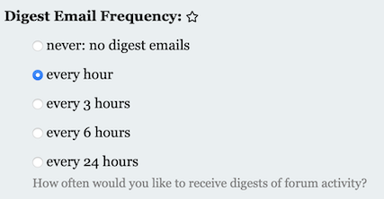

# Homework 0: Setup

Start by {{ site.hwdates[0].startdate }} or earlier |
Due on {{ site.hwdates[0].deadline }}

### Setup on Coursys

Find a group to work with for the homework assignments and the final
course project. The group size is typically between 3 to 5 people.
We will be checking that all group members are contributing equally
to the homework submission and the final project.

Along with your group members, register yourself as part of a group on [Coursys]({{ site.coursys }}).

Create a memorable name for your group. If you need help, [seek help](https://www.wordlab.com/name-generators/team-name-generator/).

Go to the [Course Discussion Page]({{ site.coursys }}) and select `Manage Subscription`.
Change the `Notification` to `Email me for new topics and replies`. It should look like this:

### Setup Git Repository

#### Git Basics

In this course, your programs will be managed and archived using [Git](https://git-scm.com). The basic idea is as follows:
* Every student and group gets a private storage area called a repository on the SFU server machines, or "repo" for short.
* Your code is stored in your repo. Every time you make a change to your code, you *commit* a new *revision* of your code to the repo for permanent storage. All revisions you ever commit are kept, and you can retrieve any committed revision any time. This means you have a combined backup and means to undo any changes you ever make. This is how software engineers manage their code projects.

#### Create new repository on Gitlab 

Decide in your group the person that will create the repository on
GitLab and invite the other group members as Developers. That person
should follow the instructions in this section.

Go to [the SFU Gitlab server](http://gitlab.cs.sfu.ca){:target="_blank"}
which is on the web at
[gitlab.cs.sfu.ca](http://gitlab.cs.sfu.ca){:target="_blank"}.  Log
in with your SFU username and password, the same one you use to
check your e-mail on SFU Connect.

Once logged in, you will see a list of your existing repos if you
have created any in the past. Create a new repository for this class
by clicking the `New Project` button at the top right of the page.

On the `New Project` page, give your repo a name under the `Project
name` field. The default name is `my-awesome-project` which is
**not** what you should call your repo. Instead, name your repo:
`nlpclass-{{ site.semcode }}-g-GROUP` where `GROUP` is the group
you registered on [Coursys]({{ site.coursys }}). For example, a
repository name might be `nlpclass-{{ site.semcode }}-g-ethicsgradient`
Make sure you add the `g-` before your group name. It's important
to name the repo exactly as you see here.

Leave all other settings as they are and click the `Create Project` button
at the bottom left of the page.

Make sure you do not change the default setting of `Private`. Your
repo must be visible only to yourself and your group members.  
**You must not give access to your repo to any other students except your group members**.
Plagiarism is a serious academic offense.

Your repo has now been created. You will be taken to a web page for
your newly created repo.

The course instructor and the TAs need access to your repo in order to test
and  grade your code. Add the instructor and TAs as a member of your
repo by clicking on the Settings menu which looks like a gear icon <i class="fa fa-gear"></i>`Settings`
on the left hand menu and selecting `Members` from the dropdown menu. On the page that loads up
type in (or individually copy/paste) the following list of names in the `Add new user` box using a `,` to
delimit each username: <code>{{ site.instructor }}</code>, 

<code>{{ ta.email }}</code>, 
. 

Change the role permissions from `Guest` to `Developer` in the
dropdown menu. Click on `Add to Project` to add the instructor and
all TAs as Developers to your github repo.

Next you should set up notifications about Issues in your repository.
Go to `User Settings` from the upper right corner menu. Select
`Notifications` from the left menu and pick the `Global notification
level` to `Watch` and also select `Receive notifications about your own activity`.
You can also set notifications specifically for your repository
to `Watch`.

#### Setup SSH Key

Next we will set up the Secure Shell (ssh) keys so you can access
your repo without a password. First follow [the instructions on
setting up your SSH key pair](https://csil-git1.cs.surrey.sfu.ca/help/ssh/README)
available at [csil-git1.cs.surrey.sfu.ca/help/ssh/README](https://csil-git1.cs.surrey.sfu.ca/help/ssh/README).
**Follow the instructions for Linux**.

Now we have to copy your public key to the GitLab server.
**The [instructions](https://csil-git1.cs.surrey.sfu.ca/help/ssh/README) ask
you to use `xclip` which may not be installed on all the CSIL machines.
If you cannot find `xclip` ("Command not found") then do the
following steps**

If you have set up your SSH key correctly then you will have a public key. View it

	cat ~/.ssh/id_rsa.pub

This will show you the public key. Use the `Terminal` copy command to **copy**
this into your clipboard.

Then go to [this page](https://csil-git1.cs.surrey.sfu.ca/profile): [csil-git1.cs.surrey.sfu.ca/profile](https://csil-git1.cs.surrey.sfu.ca/profile) and select `SSH Keys` from the left menu.

Use the web browser to paste command to **paste** your public key into the `Key`
box and give it a `Title` (e.g. 'CSIL' is a reasonable title) and then `Add key`.

#### Clone your Repository

Download a copy of your repo to your CSIL machine.  The action of
making a local copy of your online repo is known as a "clone".

In the terminal window, enter the commands

	git config --global user.name USER
	git config --global user.email USER@sfu.ca
	git config --global core.editor nano         # or set it to your favourite editor
	git config --global push.default current
	cd $HOME
	git clone git@csil-git1.cs.surrey.sfu.ca:USER/nlpclass-{{ site.semcode }}-g-GROUP.git

where `USER` is your SFU username and `GROUP` is the name of the
group you have already setup on [Coursys]({{ site.coursys }}). If
you skipped any of the above steps in setting up your GitLab repo
this command will not work.  The system might prompt you for a
username/password combo. Supply the usual answers. To avoid entering
your username/password over and over again you can set up [passwordless
ssh](http://www.linuxproblem.org/art_9.html).

Your repo will be cloned into a new directory (also known as a folder)
called `nlpclass-{{ site.semcode }}-g-GROUP`.

#### Create your Homework 0 directory

After cloning your repository, make sure you are inside your
repository and at the top level. Create a directory for Homework 0:

    mkdir hw0
    cd hw0
    pwd

When you print your working directory it should look like this:

    nlpclass-{{ site.semcode }}-g-GROUP/hw0

Add a file `README.md` to this directory using your favourite editor
and then `git add README.md` and `git commit -m "Initial hw0 commit"`
and then `git push` to send your new directory and file to the
GitLab server. Open up GitLab on a web browser to check that you
can see `hw0/README.md` in your repository on the web browser.

Add a `.gitignore` file at the top level of your git repository
to avoid committing and pushing useless files to the GitLab
server. Here is a typical `.gitignore` file.

    venv
    __pycache__
    .DS_Store
    *.egg-info
    .ipynb_checkpoints

### Python 3 Notebooks

We will be using Python 3 notebooks for the homework submissions.

First set up a virtual environment to contain all the dependencies
you need to run a Python3 notebook. To use virtualenv to manage
dependencies, first setup a virtualenv environment:

    python3 -m venv venv
    source venv/bin/activate
    pip3 install -r requirements.txt

The file `requirements.txt` should have the following contents:

    numpy
    scipy
    matplotlib
    pandas
    jupyter
    sklearn
    nltk

Typically for each homework you will add any additional software
package requirements you need into the `requirements.txt` file.
These packages should be already available on CSIL machines
so the venv should not use up too much disk space if you are
using a CSIL machine.

If you have trouble, sometime clearing the pip cache helps. Remove
the contents of `~/.cache/pip` before the pip install.

Run [jupyter notebook](http://jupyter.org/):

    jupyter notebook

Read the [jupyter
documentation](https://jupyterhub.readthedocs.io/en/stable/) and
get used to editing a notebook with a combination of markdown and
Python code.

You can either try writing your own notebook to get familiar with
it or work through my [Python tidbits
notebook](assets/notebooks/python-tidbits.ipynb).

### Solve Homework 0: Babylonian Numbers

Homework 0 is mainly to set up your groups and programming environment
for this course for the semester, but to complete this homework you
have to submit the solution to the following puzzle as your submission
for Homework 0. Submission for each homework will be done on
[Coursys]({{ site.coursys }}).

#### Decipher Babylonian numbers

The earliest known writing system originated over 5000 years ago
in what is now Iran, Iraq and other parts of Western Asia. This
writing system, called ``cuneiform,'' was used by the Elamites and
the Babylonians, and also by Persian kings to make their decrees
known, and to audit the tax returns of their many subjects. Cuneiform
was used between 3400 B.C.E and 75 C.E. The characters were inscribed
on clay or stone tablets using wedge-like instruments. Although
many inscriptions have survived, the writing system was not deciphered
by modern scholars until 1846.

In this problem you will carry out the kind of work that these
scholars had to do to decipher the cuneiform writing system. The
following (see image below) is an actual fragment from a Babylonian
educational document that was discovered in 1811. This tablet and
others allowed scholars to unlock the number system used by the
ancient Babylonians. Starting from this point, scholars were able
to extend their understanding to the entire writing system. Many
of the characters are illegible because of the ravages of time.
Nevertheless, it is possible to figure out what the missing characters
should be.  

Go to your `hw0` directory and run:

    jupyter notebook

Create a new Jupyter notebook from the Jupyter interface: 

Your job is to figure out the function that maps the numbers in the
left column in the Babylonian clay tablet above to the right column.
Once you know what that function is, write a Python function called
`foo` that takes a *decimal* number and applies the function to it
and returns the result.

Name your notebook `hw0` so that the file created is `hw0.ipynb`.
Create a Python 3 cell that contains the definition of `foo`:

    def foo(n):
        return(n) # your code here

A default Jupyter notebook is available: [hw0-default.ipynb](assets/notebooks/hw0-default.ipynb)

### Submit your homework on Coursys

When you are ready to submit follow the instructions below
to submit your homework assignment.

Go to your GitLab repository on the web and click on the
`+` dropdown menu on your project page.

Select `New tag` to create a new tag. For `Tag name` use `hw0`
and optionally write a `Message`. Then select `Create tag` to
create this tag. 

Go to [Coursys]({{ site.coursys }}). Under the `Homework 0`
activity submit your git repository URL. It will look like
this for some `USER` in your group called `g-GROUP`:

    git@csil-git1.cs.surrey.sfu.ca:USER/nlpclass-1187-g-GROUP.git

That's it. You are done with Homework 0!

### Grading

Your Homework 0 submission will be graded using the following
grading scheme:

1. Group setup done on Coursys (3 marks)
1. Git setup done correctly: name of repository is correct and matches Coursys group and has a homework 0 directory (3 marks)
1. The `hw0` directory has `requirements.txt` and a `README.md` file and a valid `hw0.ipynb` Jupyter notebook (3 marks)
1. The submission for hw0 was done correctly and on time on Coursys (3 marks)
1. The function `foo` in your `hw0.ipynb` notebook passes all the test cases (8 marks)

Note that the first two points have to be done correctly for your group
to submit any future homework assignments.

### Acknowledgements

The Babylonian tablet question appeared in a [NACLO problem
set](http://www.nacloweb.org/).  Unfortunately, I did not record
the author of this question when I first downloaded the image many
years ago.

