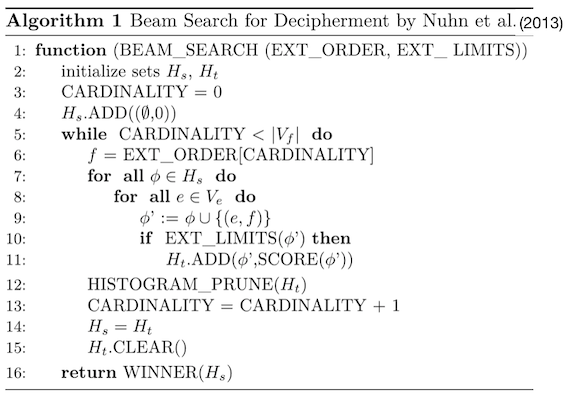

# Homework 2: Decipherment

Start by {{ site.hwdates[2].startdate }} or earlier |
Due on {{ site.hwdates[2].deadline }}

Get started:

    git clone https://github.com/anoopsarkar/nlp-class-hw.git
    cd nlp-class-hw/decipher

Clone your repository if you haven’t done it already:

    git clone git@csil-git1.cs.surrey.sfu.ca:USER/nlpclass-1187-g-GROUP.git

Then copy over the contents of the `decipher` directory above as `hw2` in your repository.

Set up the virtual environment:

    python3 -m venv venv
    source venv/bin/activate
    pip3 install -r requirements.txt

Note that if you do not change the requirements then after you have
set up the virtual environment `venv` you can simply run the following
command to get started with your development for the homework:

    source venv/bin/activate

## Background

This homework uses a language model for the task of automatic
computational decipherment of a cipher text. The text is assumed
to be originally in English (although it might have many typos) and
then encrypted using symbols that are not the English alphabet.
For this homework, we will focus on substitution ciphers.  You will
be using character language models for English to solve this homework.

A simple example of a substitution cipher is the Caesar cipher which
is a 1:1 substitution cipher where each letter in English is replaced
with exactly the same but different letter.  An example of a Caesar
cipher is the `rot13` encoding:

    import codecs
    print(codecs.encode('hello world', 'rot_13'))

This will print `uryyb jbeyq` which is the encrypted version of the
plaintext `hello world`. Computational decipherment takes the
encrypted text and finds the plaintext in English.

A slightly more complex version of a cipher is the homophonic
substitution cipher where the mapping is not 1:1. Each English
letter can be mapped to multiple cipher text symbols. Consider
the following mapping of symbols:

| $$\alpha$$ | a |
| $$\beta$$ | b |
| $$\epsilon$$ | e |
| $$\gamma$$ | g |
| $$\Gamma$$ | g |
| $$\omicron$$ | o |
| $$\eta$$ | n |
| $$\rho$$ | r |
| $$\Sigma$$ | r |
| $$\psi$$ | r |
| $$\sigma$$ | s |
| $$\tau$$ | t |
| $$\upsilon$$ | u |
| $$\omega$$ | y |

Notice that `g` and `r` are mapped to multiple cipher symbols.
With the above key, you can easily decode the following cipher
text:

$$\tau \alpha \sigma \tau \omega \omicron \Sigma \gamma \alpha \eta \beta \upsilon \rho \Gamma \epsilon \psi \sigma$$

## The Challenge

In this homework, we have provided you with a cipher text of 408
tokens in the file `decipher/data/cipher.txt`:

    º∫P/Z/uB∫ÀOR•–X•B
    WV+≈GyF∞ºHPπKÇ—y≈
    MJy^uIÀΩ—T‘NQyDµ£
    S¢/º∑BPORAu∫∆R×E
    À^LMZJƒ“\–FHVW≈æy
    π+—GDºKI£∞—X浧S¢
    RN‘IyEÃOæ—GBTQS∑B
    Lƒ/P∑BπX—EHMu^RRÀ
    √ZK—–I£W—ÇæµLM“º∑
    BPDR+j•∞\N¢≈EuHÀF
    Z√–OVWIµ+‘L£Ã^R∞H
    IºDR∏Ty“\ƒ≈/πXJQA
    PµMæRu‘∫L£NVEKH•G
    “IÇJÀµºæLMÃNA£Z¢P
    §u–ÀAº∑BVW\+VT‘OP
    ^•S“Ã∆u≈∞ΩD§G∫∫IM
    NÀ£S√E/º∫∫Z∆AP∑BV
    –≈X—W—∏F∑æ√+πºAºB
    ∫OTµRu√+∏ƒy—∏^S—W
    VZ≈GyKE∏TyAº∫∑L‘∏
    HÇFBXº§XADƒ\ΩLÇ•—
    ∏≈ƒ∑∑∞≈µPORXQF∫G√
    ZπJT‘—∏æJI+“BPQW∞
    VEX“ºWI∞—EHM£•uIÀ

There is no newline at the end of the file and the newlines in the
cipher text file are not part of the cipher.

The plaintext is in the English language. While the plaintext
language is English, the writer of this cipher text may have inserted
junk sequences and might have intentionally or unintentionally added
misspellings of English words before encrypting the message using
a homophonic cipher. Your challenge is to decode this message using
the character language models provided to you.

**Warning: The cipher in this homework is real. If you are able to
decipher the contents you will definitely find the deciphered message
very disturbing to read. This is because this homework uses a 
cipher that was used in a real-world criminal investigation in the late
1960s, early 1970s. Despite the fact that this letter was deciphered,
the criminal was never caught. My apologies if you find the plaintext
disturbing to read.**

### The Data

* The file `decipher.ipynb` contains the starter Python notebook. You can copy and modify this file for your submission.
* The ciphertext is given in the file `decipher/data/cipher.txt`. There is no newline at the end of the file. All characters in this file except the newline characters are cipher characters.
* An ngram language model is given in the file `decipher/data/6-gram-wiki-char.lm.bz2` which is a bzip2 file. The Python program `ngram.py` has a character language model implementation that can read this data file.

### Default Submission

The default submission for this homework is described in `decipher.ipynb`.

The default solution matches the frequency of symbols in the cipher text with frequency of letters in the plaintext language (in this case, English). Note that this is just some text in English used to compute letter frequencies. We do not have access to the real plaintext in this homework. 

In order to do compute plaintext frequencies, we use an English dataset has no punctuation or spaces and all characters are lowercase.

We have all the tools we need to describe the default solution to this homework.

We use a simple frequency matching heuristic to map cipher symbols to English letters.

We match the frequencies using the function f() of each cipher symbol c with each English letter e:

$$h(c,e) = | \log(\frac{f(c)}{f(e)})) | $$

For each cipher text symbol c we then compute the most likely plain text symbol e by sorting based on the above score.
Using this scoring function we map each cipher symbol to the most likely English letter which provides a decipherment (although not a very good one) of the cipher text.

### The Baseline

The baseline method you will implement is a beam search algorithm for decipherment that uses
character language models.

### Your Task

Your solution to this homework should take a cipher text where the
plaintext is assumed to be in the English language (with typos,
etc.) and using a character language model it should decipher the
cipher text and provide the plaintext.  The output is assumed to
contain no spaces or punctuation and is in lower case. This matches
the character language models that have been provided to you. You
cannot use any external data sources for this homework. You can
only use the language models provided to you.

You have to document your development of your grammars in your
Python notebook called `decipher.ipynb` in your submission.
As usual you have been given a default `decipher.ipynb` which
is described above in the Default Submission section.

Before you submit your homework add a file `doc/README.username`
that documents the work done by each `username` in your group. Group
members can get zero marks if they do not have this file that shows
that they worked on the homework equally with other group members.
Put any instructions to the TA and instructor in `doc/README.txt`
or `doc/README.md`.

### Further Reading

You can improve upon the baseline in many ways. The following papers
describe some methods to get a better performance for the decipherment
task (some papers focus on accuracy and some focus on speed)

1. [An Exact A\* Method for Deciphering Letter-Substitution Ciphers](http://www.mt-archive.info/ACL-2010-Corlett.pdf)
1. [Beam Search for Solving Substitution Ciphers](https://pdfs.semanticscholar.org/690b/6a1e710e9b3569d536f428b2d0532d9bea08.pdf)
1. [Improved Decipherment of Homophonic Ciphers](http://emnlp2014.org/papers/pdf/EMNLP2014184.pdf)
1. [Solving Substitution Ciphers with Combined Language Models](http://www.aclweb.org/anthology/C14-1218)
1. [Decipherment of Substitution Ciphers with Neural Language Models](assets/cached/decipherment_neural_lm_emnlp2018.pdf)

### Submit your homework on Coursys

When you are ready to submit go to GitLab and select `New tag` to
create a new tag. For `Tag name` use `hw2` and optionally write a
`Message`. Then select `Create tag` to create this tag.

Go to [Coursys]({{ site.coursys }}). Under the `Homework 2`
activity submit your git repository URL. It will look like
this for some `USER` in your group called `g-GROUP`:

    git@csil-git1.cs.surrey.sfu.ca:USER/nlpclass-1187-g-GROUP.git

The instructions are provided in more detail in [Homework 0](hw0.html).

That's it. You are done with Homework 2!

### Grading

Your submission will be graded using the following
grading scheme:

## Acknowledgements

Thanks to Nishant Kambhatla for curating some of the data and the
source code for this homework.
